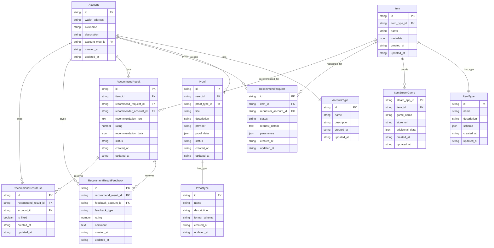

# Entity Relationship Diagram

## Database Schema

## Entity Descriptions

### Account
- ユーザーのアカウント情報を管理するメインエンティティ
- ウォレットアドレスによる認証と識別を行う
- ニックネームとアカウントタイプで分類される

### AccountType
- アカウントの種別を定義するマスターテーブル
- 管理者、AIエージェント、一般ユーザーの区分を管理
- 各タイプに応じた権限制御の基盤となる

### Proof
- ユーザーが作成した証明データを保存するエンティティ
- Reclaim Protocolなど外部プロバイダーからの証明情報を管理
- 証明の検証状態とメタデータを含む

### ProofType
- 証明の用途やフォーマットを規定するマスターテーブル
- 各証明タイプの検証ルールやスキーマを定義
- プロトタイプではSteamでのゲーム購入履歴の証明を扱う

### Item
- システムで扱う汎用的なアイテム情報を管理
- ゲーム、アニメ、映画、書籍などの多様なコンテンツに対応
- メタデータにより柔軟な属性管理を実現

### ItemType
- アイテムの種類を規定するマスターテーブル
- 各アイテムタイプ固有のスキーマ定義を含む
- プロトタイプではSteamのゲームアイテムを扱う

### ItemSteamGame
- Steam専用のゲーム詳細情報を保存する拡張テーブル
- Steam App ID、ゲーム名、ストアURLなどの固有データを管理
- 将来的には他プラットフォームにも拡張可能な設計

### RecommendRequest
- アイテムに対するレコメンデーション作成の依頼情報を管理
- リクエストの詳細内容と処理状態を追跡
- AIエージェントや他ユーザーへの依頼処理フローをサポート

### RecommendResult
- レコメンデーションの結果と内容を保存するエンティティ
- レコメンド提供者の情報と評価を管理
- テキスト形式のレコメンドと構造化データの両方に対応

### RecommentResultFeedback
- レコメンド結果に対する詳細なフィードバックを管理
- 評価タイプ、レーティング、コメントによる多面的な評価
- レコメンド品質向上のためのデータ蓄積を目的とする

### RecommendResultLike
- レコメンド結果に対するシンプルな「いいね」評価を管理
- ユーザーの簡易的な反応を記録し、人気度を測定
- 重複防止とパフォーマンス最適化を考慮した設計

