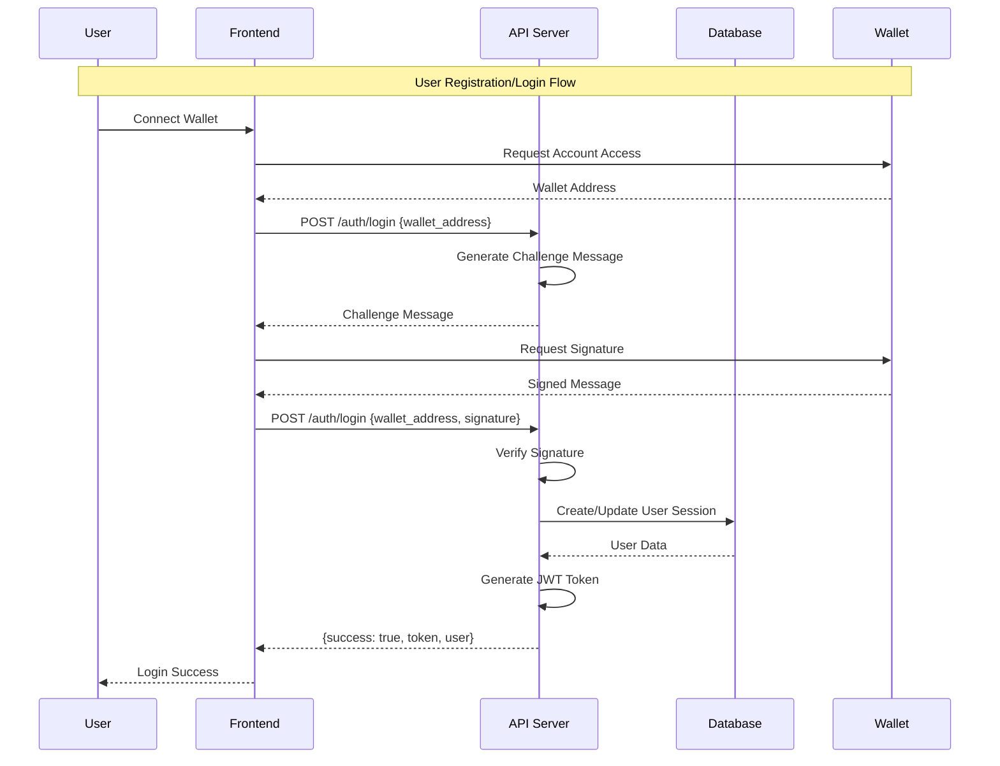
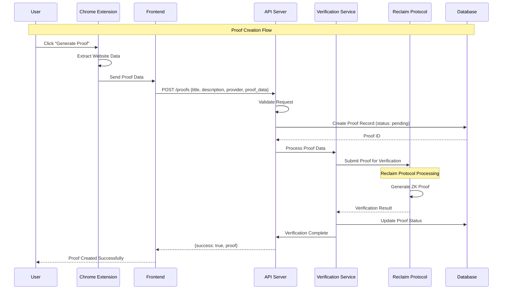
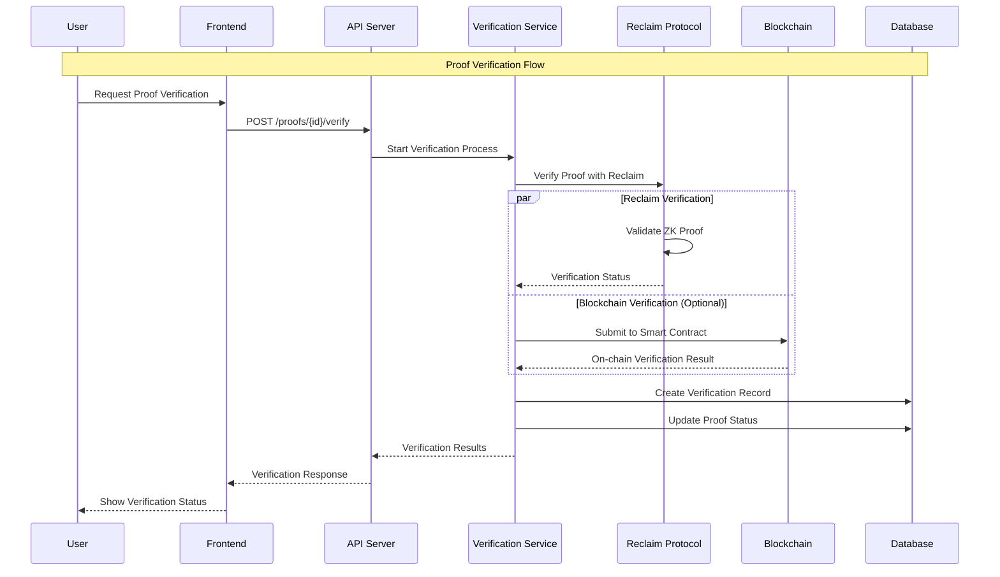
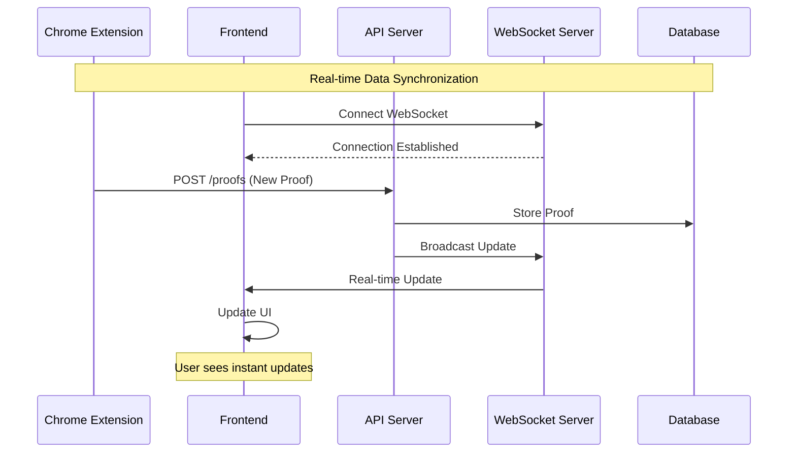
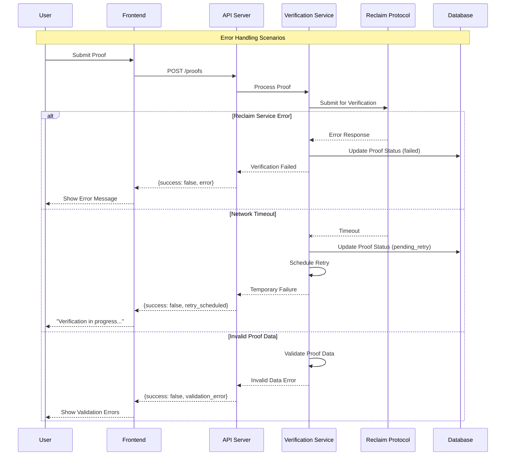
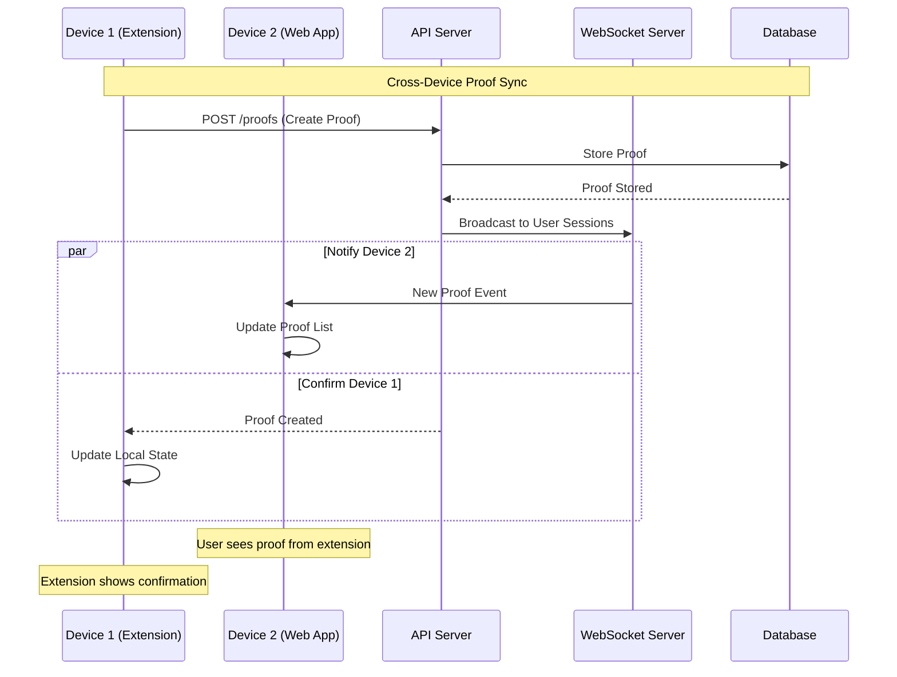
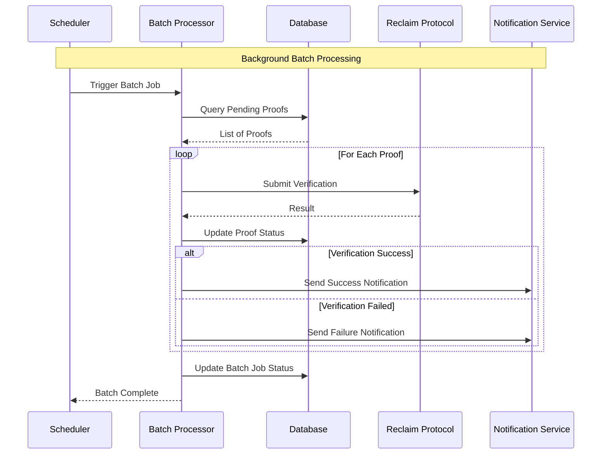

# Sequence Diagrams

## User Registration and Login Flow

## Proof Creation Flow

## Proof Verification Flow

## Data Synchronization Flow

## Error Handling Flow

## Multi-Device Synchronization

## Batch Processing Flow

