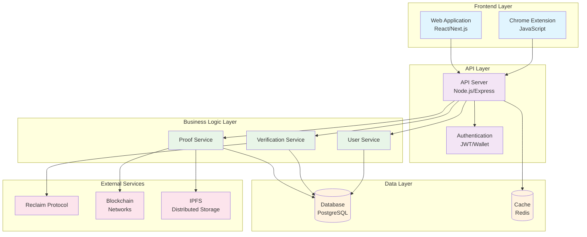
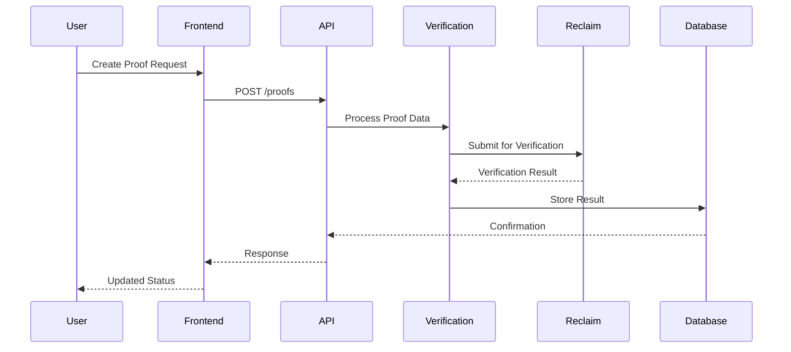

# System Architecture

## High-Level Architecture

## Component Details

### Frontend Layer

#### Web Application
- **Technology**: React/Next.js
- **Purpose**: Main user interface for proof creation and management
- **Features**:
  - Wallet connection
  - Proof dashboard
  - Verification status tracking

#### Chrome Extension
- **Technology**: JavaScript/HTML/CSS
- **Purpose**: Browser integration for seamless proof collection
- **Features**:
  - One-click proof generation
  - Website data extraction
  - Background script processing

### API Layer

#### API Server
- **Technology**: Node.js/Express
- **Purpose**: Central API gateway
- **Responsibilities**:
  - Request routing
  - Response formatting
  - Middleware processing
  - Rate limiting

#### Authentication
- **Technology**: JWT + Wallet signatures
- **Purpose**: User authentication and authorization
- **Features**:
  - Wallet-based login
  - Session management
  - Permission control

### Business Logic Layer

#### Proof Service
- **Purpose**: Core proof management
- **Responsibilities**:
  - Proof creation
  - Data validation
  - Status tracking
  - Metadata management

#### Verification Service
- **Purpose**: Proof verification logic
- **Responsibilities**:
  - Reclaim Protocol integration
  - Verification result processing
  - Trust score calculation

#### User Service
- **Purpose**: User account management
- **Responsibilities**:
  - User registration
  - Profile management
  - Preferences handling

### Data Layer

#### Database (PostgreSQL)
- **Purpose**: Primary data storage
- **Contents**:
  - User accounts
  - Proof records
  - Verification results
  - Session data

#### Cache (Redis)
- **Purpose**: Performance optimization
- **Contents**:
  - Session tokens
  - Frequently accessed data
  - Rate limiting counters

### External Services

#### Reclaim Protocol
- **Purpose**: Zero-knowledge proof generation
- **Integration**: API calls for proof verification

#### Blockchain Networks
- **Purpose**: Decentralized verification and storage
- **Supported**: Ethereum, Polygon, etc.

#### IPFS
- **Purpose**: Distributed file storage
- **Use Cases**:
  - Proof metadata storage
  - Large file handling

## Data Flow

## Security Considerations

### Authentication
- Wallet-based authentication
- JWT token management
- Session expiration handling

### Data Protection
- Encrypted sensitive data
- Secure API endpoints
- Input validation and sanitization

### External Integrations
- Secure communication with Reclaim Protocol
- Blockchain interaction security
- IPFS content verification

## Scalability

### Horizontal Scaling
- Load balancer for API servers
- Database read replicas
- Microservice architecture preparation

### Performance Optimization
- Redis caching strategy
- Database query optimization
- CDN for static assets

### Monitoring
- Application performance monitoring
- Error tracking and logging
- Health check endpoints